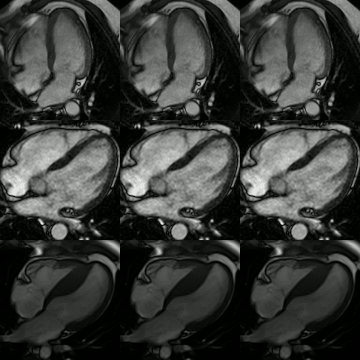
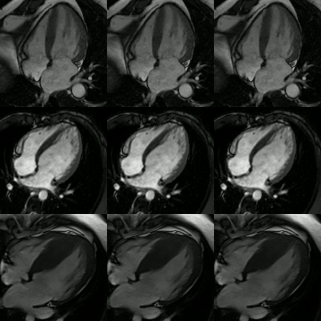

      

# DENT

**DENT: Deformation ENcoding Transformer**  

- DENT is currently under review. The trained model will be released upon the manuscript being accepted. 

|   TR = 50 – 90 ms    | DENT Two-Fold  | TR= 25 – 45 ms   | 
| ------------------- | --------------- | ---------------- | 

 

 

External testing of DENT rate 2 on 4-chamber cines with temporal resolution spacing of 50 – 90 ms. First column, input cine whose original frame rate was reduced by half. Second column, DENT-interpolated cine using rate 2. Third column, original cine. Cines are shown across multiple vendors (rows 1 – 3).

 

|   TR = 100 – 180 ms    | DENT Two-Fold  | TR= 50 – 90 ms   | 
| ------------------- | --------------- | ---------------- | 

 

 

External testing of DENT rate 2 on 4-chamber cines with temporal resolution spacing of 100 – 180 ms. First column, input cine whose original frame rate was reduced by half. Second column, DENT-interpolate cine using rate 2. Third column, original cine. Cines are shown across multiple vendors (rows 1 – 3).

 

 

External testing of DENT rate 4 on short axis cine with 144 ms temporal resolution. First column, input cine whose original frame rate was reduced by 4. Second column, DENT-interpolate cine using rate 2 producing a frame rate / 2. Third column, DENT-interpolate cine using rate 2 was applied a second time, which restored the frame rate. Fourth column, original cine. 

 

 

External testing of DENT rate 4 on 4-chamber cine with 38 ms temporal resolution (right atrial view). Closer view of the right atria. Left, original cine with a temporal resolution of 38 ms. Right, DENT-interpolate rate 4 cine with a temporal resolution of 9.5 ms. 